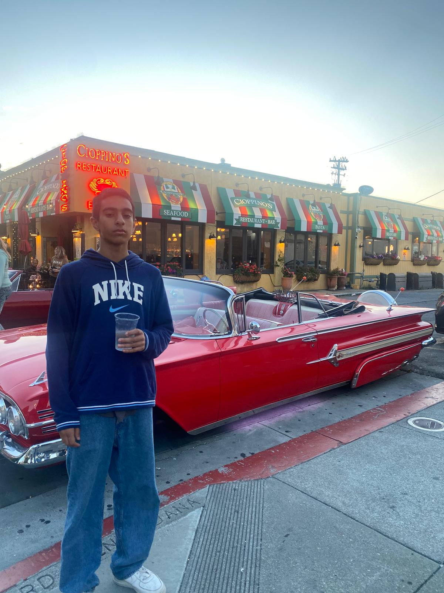

<html lang="en">
<head>
    <meta charset="UTF-8">
    <meta name="viewport" content="width=device-width, initial-scale=1.0">
    <title>Button to Journey Page</title>
    
</head>
<body>
    <!-- Anchor styled as a button -->
    <a href="my%20jourey" class="my-button">Go to Journey Page</a>
</body>
</html>
<html>
<html lang="en">
<head>
    <meta charset="UTF-8">
    <meta name="viewport" content="width=device-width, initial-scale=1.0">
    <title>Redirect Button</title>
    
</head>
<html lang="en">
<head>
    <meta charset="UTF-8">
    <meta name="viewport" content="width=device-width, initial-scale=1.0">
    <title>Redirect Button</title>
    
</head>
<body>
    <button class="redirect-button" onclick="window.location.href='https://clicktheredbutton.com/';">
        Red button!
    </button>
</body>
</html>
<body>
    <button class="redirect-button" onclick="window.location.href='https://www.cheetos.com/';">
        Free Cheetos!!!
    </button>
</body>
</html>

<head>
<meta name="viewport" content="width=device-width, initial-scale=1">

</head>
<body style="background-color:white;">

<h2>Hi, my name is Ahmad</h2>

Move the mouse over the button to open the dropdown menu.

  <button class="dropbtn">sub menu</button>
  

    <a href="#"><a href="http://127.0.0.1:4100/Ahmad_2025/aboutme/">about me</a>
</a>
    <a href="http://127.0.0.1:4100/Ahmad_2025/calculator/">calculator</a>
    <a href="http://127.0.0.1:4100/Ahmad_2025/cookieclicker/">cookie clicker</a>
  

</body>
</html>

Monkeys are fascinating primates known for their intelligence, agility, and social behavior. They are found in diverse habitats across the globe, from tropical rainforests to savannas, and they play crucial roles in their ecosystems. With over 260 species, monkeys exhibit a wide range of sizes, colors, and adaptations. Some, like the capuchin, are adept tool users, demonstrating remarkable problem-solving skills, while others, such as the howler monkey, are known for their distinctive vocalizations that can be heard over long distances. Monkeys live in complex social structures, often forming tight-knit groups where they engage in intricate social interactions, grooming, and play. Their behaviors and adaptability continue to intrigue researchers and animal enthusiasts alike, highlighting the rich diversity and evolutionary success of these remarkable animals.

<!-- Liquid:  statements -->

<!-- Include submenu from _includes to top of pages -->

<!--- Concatenation of site URL to frontmatter image  --->

<!--- Has is a list variable containing mario metadata for sprite --->
  
<!--- Size width/height of Sprit images --->


<!--- HTML for page contains 
 tag named "Mario" and class properties for a "sprite"  -->

  

<!--- Embedded executable code--->

<a href="https://www.treehugger.com/things-you-didnt-know-about-monkeys-4869728" style="font-size: 3vw;">interesting facts about monkeys!!!🙈 🙉 🙊 🐒</a>

<a href="https://en.wikipedia.org/wiki/Pakistan" style="font-size: 3vw;">Pakistan Zindabad!!!</a>

Pakistan is a diverse and culturally rich country located in South Asia, bordered by India, Afghanistan, Iran, and China. Established in 1947, it was created as a separate nation for Muslims of the Indian subcontinent, and it has a complex history shaped by its unique geographical and cultural landscapes. Pakistan is known for its stunning natural beauty, which includes the towering peaks of the Himalayas and the Karakoram Range, the lush greenery of the Punjab region, and the arid expanses of the Balochistan desert. The country boasts a rich cultural heritage that reflects a blend of South Asian, Central Asian, and Middle Eastern influences. Its cities, such as Karachi, Lahore, and Islamabad, are vibrant centers of commerce, history, and culture. Pakistan also has a growing economy and is strategically important in regional and global geopolitics. Despite facing various challenges, Pakistan continues to be a nation with a deep historical legacy and a dynamic, evolving identity.

